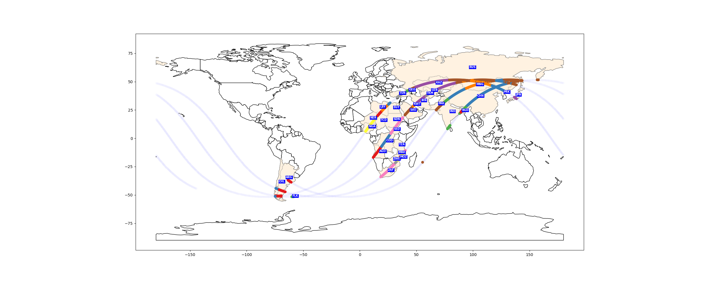

<div align="center">
<table>
<tbody>
 <tr>
    <td>
        
        
         
    </td>
 </tr>
 <tr>
<td align="center">
<br>
<h2>Python Tool for Tracking the Movement of the International Space Station and Identifying the Weather Condition along the Track</h2>

</td>
 </tr>
</tbody>
</table>
</div>

<p align="center">
<b>Jules Kouatchou</b> <br />
NASA/GSFC - SSAI <br />
Code 606 <br />
Greenbelt, MD 20771 <br />
Jules.Kouatchou@nasa.gov
</p>

<p align="center">
<b>Cindy Chen</b> <br \>
Acton Boxborough Regional High School <br \>
36 Charter Rd, Acton, MA 01720 <br />
cinderellazhouchen@gmail.com 
</p>

<p align="center">
<b>Abstract:</b> <br />
At any given time, it is possible to know the planar position 
(latitude, longitude) of the International Space Station (ISS). 
The ISS cycles the globe every 90 minutes. 
We write a Python application 
(relying on the packages Pandas, Shapely, GeoPandas and MovingPandas) 
that collects a time series (over several hours) of the positions of the ISS, 
identifies the cycles (each time the ISS crosses the longitude 180 degree), 
and plots the tracks. 
We also determine the weather current conditions (temperature, wind speed) 
of each land point along the track and perform interactive visualizations.
</p>

[Website](https://github.com/astg606/pycon/tree/main/year2024/poster) •  [Contact Us](mailto:Jules.Kouatchou@nasa.gov)


## Introduction

The [International Space Station (ISS)](https://www.nasa.gov/international-space-station/) 
is a permanently crewed on-orbit laboratory that enables scientific research supporting innovation on Earth and future deep space exploration.
An international partnership of space agencies provides and operates the elements of the ISS. 
The principals are the space agencies of the United States, Russia, Europe, Japan, and Canada. 
The ISS Program brings together international flight crews, multiple launch vehicles, globally distributed launch, operations, training, engineering, and development facilities; communications networks, and the international scientific research community.
The ISS has been humanity’s platform to learn about living in space, as well as observing the Earth and performing research that has benefited us here on Earth.
Though it first module was initially put in orbit in November 1998, it has been continuously occupied by astronauts since November 2000.

The ISS maintains an orbit with an average altitude of 400 kilometres (250 mi).
In 24 hours, the space station makes 16 orbits of Earth, traveling through 16 sunrises and sunsets.
It travels at a speed of five miles per second, circling Earth about every 90 minutes, that is 
 an equivalent distance to the Moon and back in about a day.
 ISS passes over places between latitudes 52 degrees north and 52 degrees south at different times of the day. 


At any given time, we can determine the exact location (in terms of latitude and longitude) of ISS.
It is even possible to determine its future locations.
In 2012 NASA launched its `"Spot the Station"` service, which sends people text and email alerts when the station is due to fly above their town. 
Because the station’s orbital path takes it over 90 percent of the Earth’s population, 
the service allows most people of Earth to see above them the station. 


There are many web pages that show the position of ISS. 
We can mention for instance:

- [Spot the Station](https://spotthestation.nasa.gov/): A NASA webpage that displays a live ISS tracking map and provides information on how watch ISS pass overhead at any world city.
- [Where is the International Space Station?](https://www.esa.int/Science_Exploration/Human_and_Robotic_Exploration/International_Space_Station/Where_is_the_International_Space_Station): A European Space Agency (ESA) tracker that shows where ISS is right now and its path 90 minutes ago and 90 minutes ahead.  
- [Current position of the ISS](https://www.astroviewer.net/iss/en/): Provide the current  the view from the ISS directly down to earth and the ground track of the ISS's next orbit.
- [Real-Time ISS Tracker Map](https://isstracker.pl/en): Show an interactive map of the world with the current ISS position and its future path.
- [ISS Tracker 3D - International Space Station - REAL TIME TRACKING](https://www.satflare.com/track.asp?q=25544#TOP): Provide interactive maps for the current position and future ISS orbit.


The space station carries a variety of automated sensors and facilities, 
Many of the instruments collect data about the global climate, environmental change, and natural hazards.
The instruments are important to study phenomenas like heat islands, 
to track concentrated atmospheric particles and water vapor belched into the stratosphere, 
or to determine the type and distribution of minerals in the dust of Earth’s arid regions. 
For instance, the ECOsystem Spaceborne Thermal Radiometer Experiment (ECOSTRESS) takes high-resolution 
thermal infrared measurements of the temperature of the ground.
We can also mention the Stratospheric Aerosol and Gas Experiment (SAGE III-ISS) that measures gases and tiny particles in the atmosphere that play significant roles in atmospheric processes.


## How the time series data was generated

The webpage:

<p align="center">
<a href="http://api.open-notify.org/iss-now.json">http://api.open-notify.org/iss-now.json</a>
</p>

provides basic information (in `JSON` format) on ISS: current time (in timestamp format) and location (latitude and longitude). 
We wrote a script that web scraps the page (every five seconds) to obtain the information.
For each position (with the corresponding time), it determines if it is a land or not (ocean),
the country name of the location, and the current weather conditions (temperature, wind speed).
The timeseries data 
(date/time, latitude, longitude, temperature, wind speed, country name) 
was stored in Pandas DataFrame and then saved in a CSV file for a future analysis.
Each iteration of the data collection can be summarized in the steps:

1. Access the webpage
2. Grab the content of the webpage
3. Parse the content to extract the current timestamp, the latitude and longitude
4. Convert the timestamp into a datetime object
5. Detemine if the location is a land or not (true or false)
6. Perform web scraping to get the current (forecast) temperature and wind speed at the location. We scrap the [https://api.open-meteo.com/v1/forecast](https://api.open-meteo.com/v1/forecast) portal to obtain the desire information.
7. Determine the country name of the location
8. Use the previous and current locations to determine if ISS crossed the longitude 180. This is needed to identify individual ISS tracks (a track is each time ISS goes from -180 to 180 degree).
7. Store the data (time, latitude, longitude, land flag, temperature, wind speed, track identifier, country) as a row of a `pandas` DataFrame.
    
The following Python packages were required to perform the above tasks: 

- [requests](https://requests.readthedocs.io/en/latest/): To access a webage and extract its content.
- [json](https://docs.python.org/3/library/json.html): To parse the content (in JSON format) of a webpage.
- [datetime](https://docs.python.org/3/library/datetime.html): To convert the timestamp into a datetime object.
- [global-land-mask](https://pypi.org/project/global-land-mask/): To determine if a given location is a land or not.
- [reverse_geocode](https://pypi.org/project/reverse_geocoder/): To determine the country of a location.
- [pandas](https://pandas.pydata.org/): To store the timeseries data into a DataFrame.

## Processing the Data and Visualization

In the previous section, we described how to generate timeseries data 
and saved it in a CSV file.
The file, organized in columns, has data points (rows) representing 
`date/time`, `latitude`, `longitude,` `temperature`, `wind speed`, and `country name`.

#### Step 1
We use the Pandas `read_csv` function to read the CSV file and 
obtain a DataFrame, named `iss_df`.
After that, we perform various conversions to 
- Transform the time values from strings to datetime objects, 
- Create a new column (`geometry`) to transform the latitude/longitude
  pairs into Shapely geometry Points.

#### Step 2

We take the previously created Pandas DataFrame to create (with GeoPandas)
a GeoDataFrame (`iss_gdf`). 
With `iss_gdf`, we can plot the different ISS orbits over a world map.

> [!NOTE]  
> Here we have a new orbit any time the ISS crosses the International Date Line (180th meridian).


The figure above shows the trajectoy of ISS over time.
It is not easy to identify the individual orbits, the direction of ISS
(left to right or right to left), the global starting and ending positions.
The GeoDataFrame has a column that distinguishes the orbits.
If we regroup data points by orbit and redo a similar plot, we will have
the figure below.


This new plot helps us to see the different orbits but many questions remained.

#### Step 3

`iss_gdf` is used to create two distint GeoDataFrames: 
`iss_gdf_land` (for location over land) and 
`iss_gdf_ocean` (for locations over the ocean).
The two new GeoDataFrames allow us to identify the different countries
ISS overpassed. 
We added a tool that provide the name of the countries ISS flew over.
We use the information to create the figure below:




We were able to only focus on the overpassed countries by 
coloring them, writing their names, uniquely coloring the ISS paths.

### Step 4

We use the MovingPandas `TrajectoryCollection` function to convert `iss_df` into a 
trajectory object named `iss_traj`.
Now we can obtain additional information on the orbits as shown in the figure below where we can see the direction of each.


Our goal was also to include the values of weather related values along
the ISS paths.
We particularly plot the temperature field along one orbit in the figure below. 


Finally, we create interactive plots where the weather data can be obtained at any location
along an ISS path.


## Conclusion and Future Work

In this project, we were able to use web scraping to collect a timeseries
of the locations of the International Space Station (ISS) together with
weather data. 
We plotted the different ISS orbits, identified the countries ISS flew over,
and displayed the weather data on maps (static and interactive).
ISS orbits are known in advance. It will be interesting to apply what we
did in this project using future locations of ISS to create interactive 
and dynamic maps.


## References

- [REFERENCE GUIDE TO THE INTERNATIONAL SPACE STATION](https://www.nasa.gov/wp-content/uploads/2017/09/np-2015-05-022-jsc-iss-guide-2015-update-111015-508c.pdf?emrc=59b06a) from NASA.
- [ISS National Laboratory](https://www.issnationallab.org/) from the Center for the Advancement of Science in Space.
- [International Space Station](https://en.wikipedia.org/wiki/International_Space_Station) from Wikipedia.
- [International Space Station](https://www.boeing.com/space/international-space-station) from Boeing.
- [The ECOsystem Spaceborne Thermal Radiometer Experiment](https://www.jpl.nasa.gov/missions/ecosystem-spaceborne-thermal-radiometer-experiment-on-space-station-ecostress)
- [About SAGE III on ISS](https://sage.nasa.gov/missions/about-sage-iii-on-iss/)

## Appendix

> [!NOTE]  
> Highlights information that users should take into account, even when skimming.

> [!TIP]
> Optional information to help a user be more successful.

> [!IMPORTANT]  
> Crucial information necessary for users to succeed.

> [!WARNING]  
> Critical content demanding immediate user attention due to potential risks.

> [!CAUTION]
> Negative potential consequences of an action.


### Source code

The code we use to generate the time series dataset is available at:

<p align="center">
<a href="https://github.com/astg606/pycon/tree/main/year2024/poster">LINK TO CODE</a>
</p>

<details>
<summary>Click here to view the code</summary>

```python
import time
import math
import json
import pandas as pd
import datetime as dt
import requests as reqs
from global_land_mask import globe
import reverse_geocode

def get_country_name(lat: float, lon: float) -> str:
    """
    Extract the country name given the latitude/longitude information.
    This function provides a country name even when a location is on
    the ocean. We wish it was not the case.

    Parameters
    ----------
    lat : float
       Latitude of the location
    lon : float
       Longitude of the location

    Returns
    -------
    country : str
       Country name (empty string if no country)
    """
    # Get location with geocode
    lat_lon = (lat, lon),
    loc_name = reverse_geocode.search(lat_lon)
    return loc_name[0].get('country', '')

def retrieve_weather_data(lat: float, lon: float) -> tuple():
    """
    Extract the current, weather condition (temperature, windspeed)
    at a given location (latitude/longitude).

    Parameters
    ----------
    lat : float
       Latitude of the location
    lon : float
       Longitude of the location

    Returns
    -------
    temp : float
       Current temperature at the location
    windspeed : float
       Current windspeed at the location
    """
    base_url = "https://api.open-meteo.com/v1/forecast"
    payload = {'latitude': lat,
               'longitude': lon,
               'current_weather': 'true'
              }
    resp = reqs.get(base_url, params=payload).json()
    forecast = pd.DataFrame(resp)['current_weather']
    return forecast['temperature'], forecast['windspeed']

def cross_180longitude(lon: float, prev_lon: float) -> bool:
    """
    Given the current longitide (lon) location and the previous one (prev_lon),
    determine if the moving object crossed the longitude 180.
    This function is needed to create a new track when an object moves around
    the earth.

    Parameters
    ----------
    lon : float
       Current longitude between -180 and 180
    prev_lon : float
       Previous longitude between -180 and 180

    Returns
    -------
    flag : bool
       Boolean parameter to determine if the moving object crossed the longitude 180.
    """

    # We cross the longitude 180 when lon and prev_lon have opposite signs
    # and the absolute value of prev_lon is greater than 178.5.
    # Two numbers a & b are of the same sign if |a+b|=|a|+|b|.
    flag = False
    if math.fabs(lon) > 178.5:
        flag = not (math.fabs(lon + prev_lon) == math.fabs(lon) + math.fabs(prev_lon))
    return flag

def track_iss(num_records: int) -> None:
    """
    - Collect the timeseries positions (time, latitude, longitude) of the ISS
    - For each location, determine:
        - the current weather conditions
        - if it is a land or not
    - Create a Pandas DataFrame with all the data and write everything in a CSV file.

    Note that we collect the above data every 5 seconds num_records times.

    Parameters
    ---------
    num_records : int
       Number of records (positions) we want to produce.
    """

    beg_time = dt.datetime.now()
    print()
    print(f"{'-'*75}")
    print()

    #~~~~~~~~~~~~~~~~~~~~~~~~~~~~~~~~~~~~~~~~~~~~~~~~~~~~~~~~~~~~~~~~
    # Create an empty Pandas DataFrame to store the data
    #           t: date/time
    #    latitude: latitude of location
    #   longitude: longitude of location
    # temperature: current temperature at the location
    #   windspeed: current wind speed at the location
    #   land_flag: flag to determine if location is land (True/False)
    #     traj_id: trajectory id to be used by MovingPandas
    #~~~~~~~~~~~~~~~~~~~~~~~~~~~~~~~~~~~~~~~~~~~~~~~~~~~~~~~~~~~~~~~~
    columns = ['t', 'latitude', 'longitude', 'land_flag',
               'temperature', 'windspeed',
               'traj_id', 'country'
              ]
    iss_df = pd.DataFrame(columns=columns)

    #~~~~~~~~~~~~~~~~~~~~~~~~~~~~~~~~~~~~~~~~~~~~~~~~~~~~~
    # Create a loop to get the ISS info every 5 seconds
    # for a prescribed number of iterations (num_records).
    #~~~~~~~~~~~~~~~~~~~~~~~~~~~~~~~~~~~~~~~~~~~~~~~~~~~~~
    sleep_time = 5 # in seconds
    count = 0
    traj_id = 0
    while count <= num_records:

        #~~~~~~~~~~~~~~~~~~~~~~~
        # Connect to the ISS API
        #~~~~~~~~~~~~~~~~~~~~~~~
        api_url = "http://api.open-notify.org/iss-now.json"
        response = reqs.get(api_url)
        status = response.status_code

        #~~~~~~~~~~~~~~~~~~~~~~~~~~~~~~~~~~~~~~~~~~~~~~~~~~~~~~~~~~~~
        # Check status code for an appropriate response fromt the API
        #~~~~~~~~~~~~~~~~~~~~~~~~~~~~~~~~~~~~~~~~~~~~~~~~~~~~~~~~~~~~
        if response.status_code != 200:
            print(f'Error improper response code. Code is {status}')
            return None
        else:
            # Turn the API response into JSON
            resp = response.json()

            # Extract the latitude, longitude
            lat = float(resp['iss_position']['latitude'])
            lon = float(resp['iss_position']['longitude'])#%360

            # Extract the timestamp and convert it to a datetime object
            tim = float(resp['timestamp'])
            dt_obj = dt.datetime.fromtimestamp(tim)

            # Determine if a location is a land or not
            land_flag = globe.is_land(lat, lon)

            temp, wind = retrieve_weather_data(lat, lon)
            country = get_country_name(lat, lon)
            #if land_flag:
            #    country = get_country_name(lat, lon)
            #    #temp, wind = retrieve_weather_data(lat, lon)
            #else:
            #    country = ''
            #    #temp, wind = -9999.0, -9999.0

            # Determine the trajectory id
            # A new trajectory is created whenever we pass the central meridian
            # A trajectory id is for a pass with longitude between -180 and 180
            if count == 0:
                prev_lon = lon

            if cross_180longitude(lon, prev_lon):
                traj_id += 1

            # Add a new row to the DataFrame
            data = [dt_obj, lat, lon, land_flag, temp, wind, traj_id, country]
            iss_df.loc[len(iss_df.index)] = data

            # pause the loop for 5 seconds to allow the ISS to move slightly
            time.sleep(sleep_time)

            # Add to the count so it doesn't access the API too many times
            count += 1
            prev_lon = lon

            print(f"{count:>5} "
                  f"Lat/Lon: {lat:.3f}/{lon:.3f} "
                  f"traj_id: {traj_id:>2} "
                  f"Land: {int(land_flag)} "
                  f"Country: {country}"
                 )

    #~~~~~~~~~~~~~~~~~~~
    # Save in a cvs file
    #~~~~~~~~~~~~~~~~~~~
    end_time = dt.datetime.now()
    file_name = beg_time.strftime("iss_timeseries_trajectories_%Y%m%d_%H%M%S.csv")
    iss_df.to_csv(file_name, sep=',', index=False)

    print()
    print(f"Data written into: {file_name}")
    print()
    print(f"{'-'*75}")
    print(f'Starting date: {beg_time.strftime("%Y/%m/%d %H/%M/%S")}')
    print(f'Ending date:   {end_time.strftime("%Y/%m/%d %H/%M/%S")}')
    print(f"Elapsed time:  {(end_time-beg_time).total_seconds()} s")
    print(f"{'-'*75}")
    print()

if __name__ == '__main__':

    num_records = 2000
    track_iss(num_records)

```
</details>

