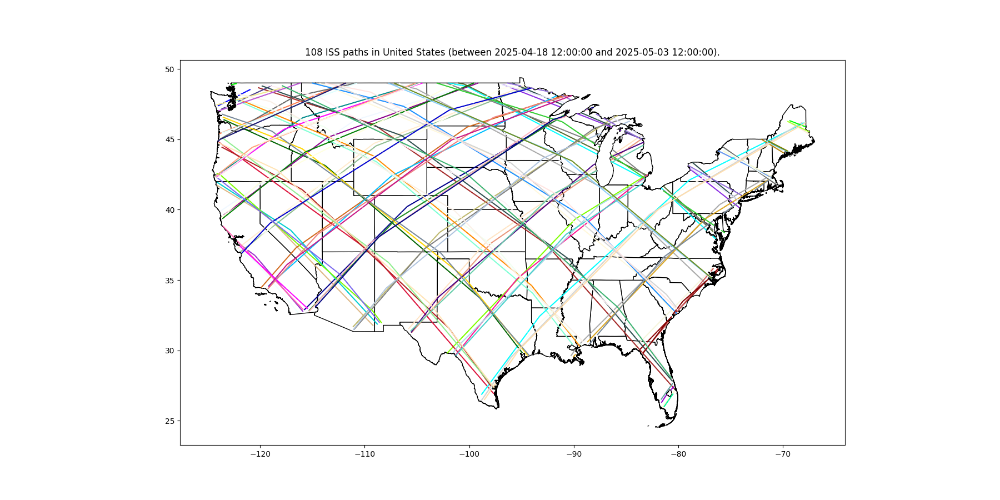

<div align="center">
<table>
<tbody>
 <tr>
    <td>
        
        
         
    </td>
 </tr>
 <tr>
<td align="center">
<br>
<h2>Weather Data along the International Space Station Orbits </h2>

</td>
 </tr>
</tbody>
</table>
</div>

<p align="center">
<b>Jules Kouatchou</b> <br />
NASA/GSFC - SSAI <br />
Code 606 <br />
Greenbelt, MD 20771 <br />
Jules.Kouatchou@nasa.gov
</p>


<p align="center">
<b>Khalil Alexander</b> <br \>
Eleanor Roosevelt High School <br \>
7601 Hanover Parkway, Greenbelt, MD 20770 <br />
khalilalexander613@gmail.com
</p>

<p align="center">
<b>Cindy Chen</b> <br \>
Acton Boxborough Regional High School <br \>
36 Charter Rd, Acton, MA 01720 <br />
cinderellazhouchen@gmail.com 
</p>

<p align="center">
<b>Abstract:</b> <br />
The International Space Station (ISS) is a space station that 
circles (from west to east) the Earth about every 90 minutes and 
passes over places between latitudes 52 degrees south and 
52 degrees north at different times of the day. 
It is possible to know the future planar position of ISS. 
We write a standalone Python application that determines such 
future positions (over a 14-day period) and performs data analytics. 
The tool also focuses on any individual ISS orbit to gather weather 
conditions along ISS’ path and perform various visualizations.

</p>

[Website](https://github.com/astg606/pycon/tree/main/year2025/poster) •  [Contact Us](mailto:Jules.Kouatchou@nasa.gov)


## Introduction
In a previous work:

[Python tool for tracking the movement of the International Space Station and identifying the weather condition along the track](https://github.com/astg606/pycon/tree/main/year2024/poster)

we collected current positions (every 5 seconds over a couple of hours) of the
[International Space Station (ISS)](https://www.nasa.gov/international-space-station/).
The gathered data was then analyzed to extract the different orbits, to identify
the countries overpassed on a given orbit and to plot weather condition along an orbit.
This work was mainly retrospective in the sense that our analyse was done with
_past_ data.
We want here to extend the work by only using future positions of ISS and using
weather forecast data.
We also aim to gather more statistcs on the countries visited by ISS.

## Python workflow
The Python application we created application performs the following steps 
to obtain future ISS positions and do various data manipulations and visualizations.

```mermaid
%%{ init: {'flowchart': { 'curve': 'stepAfter' } } }%%

flowchart TB
    %%
    A[Do web scraping to extract future ISS positions: every 4 minutes over 14 days] --> B[Convert (x, y) positions into latitudes and longitudes]
    B --> C[Identify orbits and time interpolate (every 10 seconds) on each orbit]
    C --> D[Determine country name of each location]
    E --> F[Perform data analytics]
    F --> G[Select a random orbit: do web scraping to get weather data and visualization.]
```

It takes several minutes to perform the entire workflow.
There are two main time consumming tasks:
1. __Creating locations at 10-second time intervals__:
   The original futures locations have a 4-minute interval. 
   At such a resolution, it is impossible to perform our desired analysis.
   We time interpolate the entire dataset (over 14 days) so that the ISS
   positions are every 10 seconds (the tool allows to set any number of seconds).
2. __Gathering of weather forecast data along an orbit__:
   The operation is done one location at the time. 
   It involves not only web scraping of hourly forecasts but also time interpolation.

To reduce the time used for calculations, we have an option to select
a date range so that we do not have to use the entire 14-day dataset
for time interpolation.


## Data analytics

After gathering the data (on future positions) for a given date range, 
we want to determine the number of ISS orbits, 
the number of countries visited, the countries most overpassed, etc.

From __April 14, 2025__ (at 12:00 pm) till __April 29, 2025__ (at 12:00 pm), ISS will:
- Have 217 orbits.
- Overpass 166 countries or territories.
- Fly over Russia, the United States and China 109, 108 and 105 times, respectively.

> [!NOTE]  
> We are using here the future tense because we are dealing here with future positions of ISS.


The figure above shows the percentage of countries flew over by ISS at a given frequency.
We can also create a bar chart (see figure below) to list the countries that are more often visited by ISS.


We can focus on a given country and determine the dates when ISS will be above it. 
In the figure below, we present the different ISS orbits over the United States.




## Data Visualization

Here,  we take a random full ISS’ orbit. 
We identify each location and gather weather forecast data (over the next few days).

We first map the selected orbit, color each country overpassed and provide the flag of each country.


> [!NOTE]  
> The above figure shows that ISS orbits the Earth between 52 South and 52 North. This os a confirmation that the several time interpolations (to determine new locations) we performed did not violate this principle.

Finally, we plot along the orbit the cloud cover that indicates the locations where ISS will more likely be seen from the ground.
The darker the color (on the path) the less likely it will be possible spot ISS from the ground.


## Conclusion and Future Work

In this work, we wrote a Python tool that collects (over a time range) future locations of the International Space Station (ISS) together with weather data (along an arbitrary orbit). The tool determines which countries are overpassed by ISS and at which frequency. It is also capable of mapping an orbit, labeling the countries along the track and plotting weather conditions. We plan to add more features to the tool by including major cities along tracks and by building a graphical user interface to run it.


## References
- J. Kouatchou and C. Chen, _Python tool for tracking the movement of the International Space Station and identifying the weather condition along the track_, PyCon US 2024, Poster Session, Pittsburg, PA, May 19, 2024.
- [REFERENCE GUIDE TO THE INTERNATIONAL SPACE STATION](https://www.nasa.gov/wp-content/uploads/2017/09/np-2015-05-022-jsc-iss-guide-2015-update-111015-508c.pdf?emrc=59b06a) from NASA.
- [ISS National Laboratory](https://www.issnationallab.org/) from the Center for the Advancement of Science in Space.
- [International Space Station](https://en.wikipedia.org/wiki/International_Space_Station) from Wikipedia.
- [International Space Station](https://www.boeing.com/space/international-space-station) from Boeing.
- [The ECOsystem Spaceborne Thermal Radiometer Experiment](https://www.jpl.nasa.gov/missions/ecosystem-spaceborne-thermal-radiometer-experiment-on-space-station-ecostress)
- [About SAGE III on ISS](https://sage.nasa.gov/missions/about-sage-iii-on-iss/)

